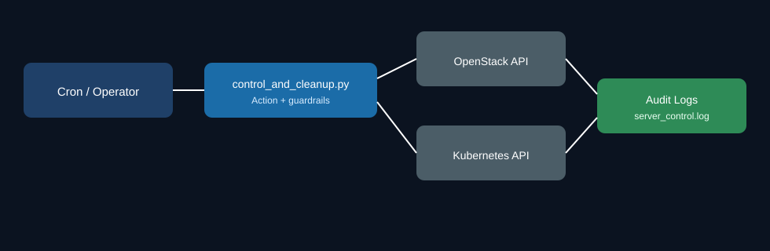

# cloud-node-pod-cleanup-tool

Operational automation for controlled OpenStack node lifecycle actions and Kubernetes duplicate-pod cleanup, built for production security operations.

## Problem
Cloud operations teams often need controlled node start/stop actions while avoiding stale or duplicate Kubernetes pods that can appear after node transitions. Manual cleanup is slow and risky in incident windows.

## Security Context
- Enforces deliberate action flow for start/stop operations.
- Improves operational resilience by cleaning inconsistent pod states.
- Supports auditable actions via log files.
- Designed to align with secure operations and compliance-oriented runbooks.
- Includes guardrails: retries, status checks, validation of target resources, and error logging.

## Evolution

This repository carries the full history of the tool, including the v1 repository
(`cloud-node-pod-cleanup`, archived) whose commits were imported here.

| | v1 (2025-05) | v2 (2026-07) |
|---|---|---|
| Node stop | Immediate OpenStack stop | `cordon` + `drain` first, so pods reschedule before the node goes down |
| Node start | Start, then assume ready | Uncordon gated on the node reporting `Ready` |
| Pod cleanup | Delete duplicates | Unchanged, but runs after drain completes |
| Namespaces | Hardcoded | Required env var, no default |
| Verification | None | pyflakes + pytest in CI |

**What changed and why.** v1 stopped the OpenStack instance directly. Kubernetes only
discovers the node is gone after the node-monitor grace period, so pods sat
`Terminating` on a dead node and their replacements were delayed by the eviction
timeout. v2 drains first, which moves the workload while the node is still able to
report status, then stops the instance. On start, the reverse: v1 uncordoned as soon
as the OpenStack API said the server was `ACTIVE`, which is before the kubelet has
registered, so the scheduler could place pods on a node that was not ready to run
them. v2 waits for `Ready` before uncordoning.

## Architecture/Flow


Flow summary:
1. Operator or scheduler calls script with `start` or `stop`.
2. Script validates cloud/Kubernetes connectivity.
3. OpenStack server action runs with status polling.
4. Kubernetes duplicate-pod cleanup runs across configured namespaces.
5. Audit logs are written for operational traceability.

## Setup
```bash
git clone git@github.com:jaskaranhundal/cloud-node-pod-cleanup-tool.git
cd cloud-node-pod-cleanup-tool
python3 -m venv .venv
source .venv/bin/activate
pip install -r requirements.txt
```

Configuration:
```bash
export PARTIAL_SERVER_NAME="node2"
export CLOUD_NAME="otc"
export NAMESPACES="team-production,team-staging"   # required, no default
```

## Example Output
```text
INFO Successfully connected to OpenStack cloud: otc
INFO Found 1 servers matching 'node2'
INFO Initiated start for server node2
INFO Server reached status ACTIVE
INFO Cleanup complete in namespace team-production
INFO Operation completed with audit logs written
```

## Limitations
- Requires valid OpenStack credentials and Kubernetes API access.
- Namespace targeting is static unless environment variables are updated.
- Cleanup logic is tuned for duplicate pod patterns and may need extension for complex controllers.

## Roadmap
- Add dry-run mode with explicit change plan output.
- Add structured JSON logs for SIEM ingestion.
- Add unit/integration tests for cleanup edge cases.
- Add optional Slack/Teams notification hooks for operational events.
